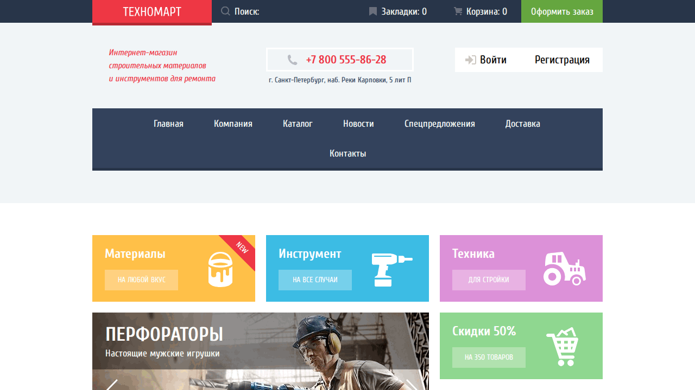

# Technomart_1notlov3

Учебный проект интернет-магазина строительных материалов и инструментов (статическая верстка).

## Overview

Проект демонстрирует многостраничную вёрстку магазина: главная страница, каталог, карточки товаров, промо-блоки и базовую навигацию.

## Demo



Live: https://1notlov3.github.io/Technomart_1notlov3/

## Features

- Главная страница с баннерами и категориями
- Страница каталога товаров
- Карточки товаров, цены, кнопки действий
- Адаптированная визуальная структура интернет-магазина

## Stack

- HTML5
- CSS3
- JavaScript (vanilla)

## Setup

Локальный запуск (без сборки):

```bash
python3 -m http.server 4101
```

Открыть: `http://localhost:4101/index.html`

## Usage

- Перейти на главную страницу
- Открыть каталог (`catalog.html`)
- Просмотреть структуру и UI компонентов магазина
